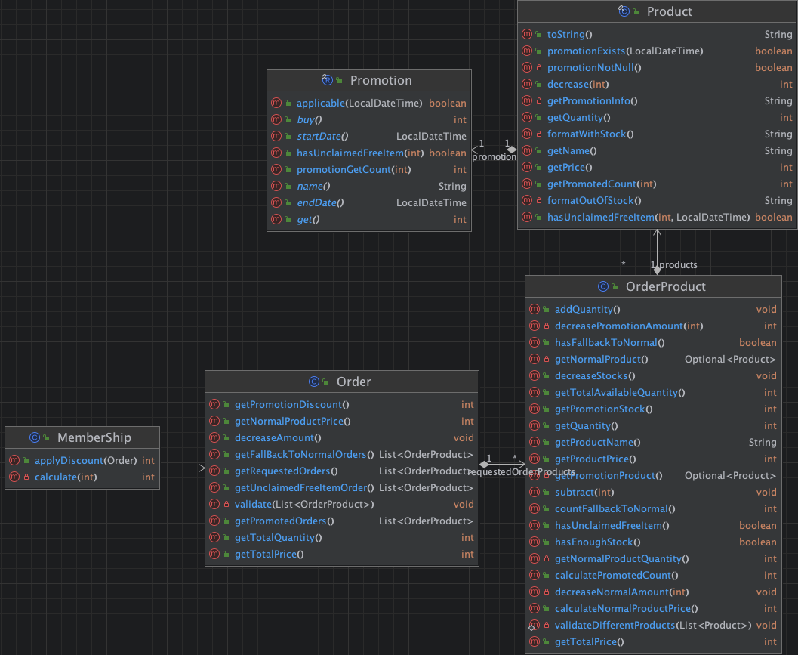

# 편의점 재고 관리 및 할인 시스템


이 어플리케이션은 편의점에서 상품의 재고를 관리하고, 다양한 할인 정책(멤버십 할인, 프로모션 할인 등)을 적용하여 고객의 주문을 처리하는 시스템입니다. 일반 상품과 프로모션 상품을 구분하여 재고를 관리하며, 주문 시 재고 확인과 할인 적용을 통해 최종 결제 금액을 산출합니다.

---

## 어플리케이션 흐름

1. **상품 등록 및 재고 관리**
  - 일반 상품과 프로모션 상품을 등록합니다.
  - 각 상품은 이름, 가격, 수량 등의 정보를 가집니다.
  - 프로모션 상품은 추가적으로 프로모션 정보(예: 1+1, 2+1 등)를 가집니다.

2. **고객 주문 처리**
  - 고객이 구매하고자 하는 상품과 수량을 선택합니다.
  - 주문 시 상품의 재고를 확인하고, 재고가 충분하지 않을 경우 예외를 발생시킵니다.
  - 프로모션 상품의 재고가 부족한 경우 일반 상품의 재고로 대체합니다.

3. **할인 적용 및 결제 금액 계산**
  - 멤버십 할인을 적용합니다. 멤버십 할인은 일반 상품 가격의 30%이며, 최대 8,000원까지 적용됩니다.
  - 프로모션 할인을 적용합니다. 프로모션 조건에 따라 무료 증정품을 제공합니다.
  - 최종 결제 금액을 계산하고 영수증을 출력합니다.

---

## 도메인 요구사항

### 1. 멤버십 (MemberShip)

- **행동**
  - 멤버십 할인을 적용합니다.
  - 할인 한도를 관리합니다.
- **상태**
  - 할인율: 30%
  - 최대 할인 금액: 8,000원
  - 남은 할인 가능 금액

### 2. 주문 (Order)

- **행동**
  - 전체 주문 상품을 관리합니다.
  - 총 결제 금액을 계산합니다.
  - 멤버십 할인과 프로모션 할인을 적용합니다.
  - 재고를 감소시킵니다.
- **상태**
  - 주문 상품 목록

### 3. 주문 상품 (OrderProduct)

- **행동**
  - 주문 수량을 관리합니다.
  - 상품 재고를 확인하고 감소시킵니다.
  - 총 가격을 계산합니다.
  - 프로모션 적용 여부를 확인합니다.
- **상태**
  - 상품 정보
  - 주문 수량
  - 주문 일자

### 4. 상품 (Product)

- **행동**
  - 상품 정보를 제공합니다.
  - 재고를 감소시킵니다.
  - 프로모션 적용 여부를 확인합니다.
- **상태**
  - 이름
  - 가격
  - 수량
  - 프로모션 정보(있을 경우)

### 5. 프로모션 (Promotion)

- **행동**
  - 프로모션 적용 여부를 확인합니다.
  - 무료 증정품 수량을 계산합니다.
- **상태**
  - 프로모션 이름
  - 조건(구매 수량, 증정 수량)
  - 시작일
  - 종료일

---

## 입출력 요구사항

1. **상품 등록**
  - 상품 정보를 입력받아 일반 상품 또는 프로모션 상품을 등록합니다.
  - 입력 데이터 검증을 수행하여 유효하지 않은 경우 예외를 발생시킵니다.

2. **고객 주문 입력**
  - 고객이 구매하고자 하는 상품명과 수량을 입력받습니다.
  - 입력된 상품이 존재하는지 확인하고, 수량이 재고를 초과하는지 검증합니다.

3. **영수증 출력**
  - 주문 내역, 할인 내역, 최종 결제 금액을 출력합니다.
  - 출력 형식 예:

    ```
    ============== 편의점 ===============
    콜라        6   6,000
    에너지바     5  10,000
    ============= 증정 ================
    콜라        2
    =====================================
    총구매액             16,000
    행사할인       -     2,000
    멤버십할인     -     3,000
    내실돈              11,000
    ```

---

## 할인 조건 및 할인 정책

- **멤버십 할인**
  - 일반 상품 가격의 30% 할인.
  - 최대 할인 금액은 8,000원까지 적용.

- **프로모션 할인**
  - 프로모션 조건에 따라 무료 증정품 제공.
  - 예: 1+1 프로모션에서는 동일 상품 1개 구매 시 1개 추가 증정.

---

## 구현에 있어서 신경 쓴 점

### 1. 복잡성 vs 확장성
이번 구현에서는 간단한 구현, 복잡한 구현 모두 시도 해 보았습니다. 구현 후 복잡성과 확장성의 트레이드오프를 고려 해 보니, 현재 구현이 확장성 있으면서도 과도하게 복잡하지 않다고 판단했습니다.

다소 복잡한 개념 분리 및 추상화는 해당 레포지토리의 브랜치 중 'complicated' 브랜치에 구현 해 두었습니다.

### 2. 레이어 분리

이번엔 '저장된 데이터'를 기반으로 어플리케이션을 작동 시켜야 하는 요구사항이 있었습니다. 

이에 따라서 저장한 데이터를 불러오는 infrastructure, 해당 데이터를 파싱/포맷 하고 레포지토리의 데이터를 불러오는 application, 입출력 데이터를 관리하는 presentation 레이어를 분리해서 관리했습니다.

이로 인해 복잡성을 과도하게 높이지 않으면서도 더 확장성 있는 설계가 가능했습니다.
